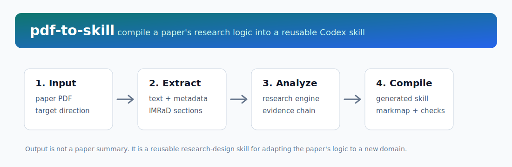
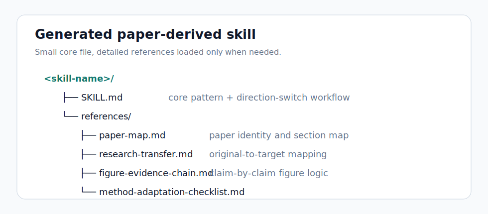

# pdf-to-skill

Turn a scientific paper PDF into a reusable Codex skill that captures the paper's transferable research logic.

`pdf-to-skill` is inspired by [`book-to-skill`](https://github.com/virgiliojr94/book-to-skill), but it targets a different job. A book skill preserves an author's frameworks across chapters. A paper skill preserves a study's research engine: the problem form, hypothesis, design skeleton, methods spine, figure evidence chain, validation strategy, and the parts that can be migrated to a new research direction.



## Why This Exists

Most paper-reading workflows produce summaries. Summaries are useful for memory, but they do not reliably help you reuse a paper's design in another domain.

`pdf-to-skill` treats a paper as a reusable research pattern:

- What problem form does the paper solve?
- What hypothesis makes the study publishable?
- What evidence chain turns data into a claim?
- Which methods are reusable, and which are domain-specific?
- How should the same logic be rebuilt for a new disease, dataset, assay, endpoint, or intervention?

## What It Extracts

| Layer | Extracted Output | Why It Matters |
|---|---|---|
| Research engine | Problem, hypothesis, novelty, claim boundary | Keeps the study logic reusable |
| Design skeleton | Samples, groups, controls, endpoints, validation | Prevents shallow topic swapping |
| Methods spine | Preprocessing, assays, models, statistics, thresholds | Preserves operational details |
| Evidence chain | Figure/table logic and claim progression | Helps rebuild a publishable story |
| Transfer map | Original element -> target-direction equivalent | Makes direction switching explicit |
| Risk checks | Confounding, overclaiming, missing validation | Reduces invalid method transfer |

## Repository Structure

```text
pdf-to-skill/
├── SKILL.md
├── README.md
├── agents/
│   └── openai.yaml
├── assets/
│   ├── output-structure.svg
│   └── workflow.svg
├── references/
│   ├── generated-skill-template.md
│   ├── method-adaptation-rubric.md
│   └── report-template.md
└── scripts/
    ├── extract_paper.py
    └── scaffold_skill.py
```

## Install

Copy or symlink this folder into your Codex skills directory:

```bash
mkdir -p ~/.codex/skills
ln -s /path/to/pdf-to-skill ~/.codex/skills/pdf-to-skill
```

Or copy it directly:

```bash
cp -R /path/to/pdf-to-skill ~/.codex/skills/pdf-to-skill
```

## Use In Codex

Ask Codex to invoke the skill with a paper and target direction:

```text
Use $pdf-to-skill to read /path/to/paper.pdf and convert its research logic into a skill for LUAD brain metastasis.
```

Analyze without generating a new skill:

```text
Use $pdf-to-skill to analyze /path/to/paper.pdf and output the transfer report plus markmap only.
```

Generate a direction-switching skill:

```text
Use $pdf-to-skill to read /path/to/paper.pdf, learn its study design, and generate a new skill for spatial transcriptomics in colorectal cancer.
```

## Run The Extractor Directly

```bash
python3 scripts/extract_paper.py /path/to/paper.pdf
```

Supported inputs:

- `.pdf`
- `.txt`
- `.md`
- `.docx`

The extractor writes text, metadata, and coarse section offsets to:

```text
/tmp/pdf_to_skill_work/
├── full_text.txt
├── metadata.json
└── sections.json
```

Optional PDF extraction tools:

```bash
# Best CLI fallback for PDFs
brew install poppler

# Python fallbacks
python3 -m pip install PyPDF2 pdfminer.six python-docx
```

## Create A Blank Paper-Derived Skill Scaffold

Use this when you already know the target direction and want a clean folder for Codex to fill after reading the paper.

```bash
python3 scripts/scaffold_skill.py \
  --name luad-brain-metastasis-paper-logic \
  --title "Short Paper Title" \
  --target "LUAD brain metastasis" \
  --out ~/.codex/skills
```

It creates:



```text
<skill-name>/
├── SKILL.md
└── references/
    ├── paper-map.md
    ├── research-transfer.md
    ├── figure-evidence-chain.md
    └── method-adaptation-checklist.md
```

## Generated Skill Contract

A generated paper skill should help the user apply a paper's research thinking to a new direction. It should not be a paper summary.

The generated `SKILL.md` should include:

- when to use the skill
- the original paper's core research pattern
- a target-switch workflow
- reusable design modules
- "do not over-transfer" cautions
- references for paper map, transfer logic, figure chain, and method checklist

## Markmap Overview

```markmap
# pdf-to-skill
## Input
### Scientific paper PDF
### Target research direction
## Extraction
### Text and metadata
### IMRaD sections
### DOI and title guess
## Research Engine
### Problem form
### Central hypothesis
### Novelty source
### Study design skeleton
### Methods spine
### Validation logic
## Transfer
### Original population -> target population
### Original variable -> target variable
### Original endpoint -> target endpoint
### Original validation -> target validation
### Original figure logic -> target figure plan
## Output
### Research transfer report
### Generated Codex skill
### Figure evidence chain
### Method adaptation checklist
```

## Design Principles

- Extract structure, not a prose summary.
- Preserve exact method names, endpoints, datasets, cohorts, assays, and statistical tests.
- Separate what the original paper proved from what can only be used as inspiration.
- Make direction switching explicit with original-to-target mappings.
- Keep the generated `SKILL.md` compact and put detailed paper notes in `references/`.
